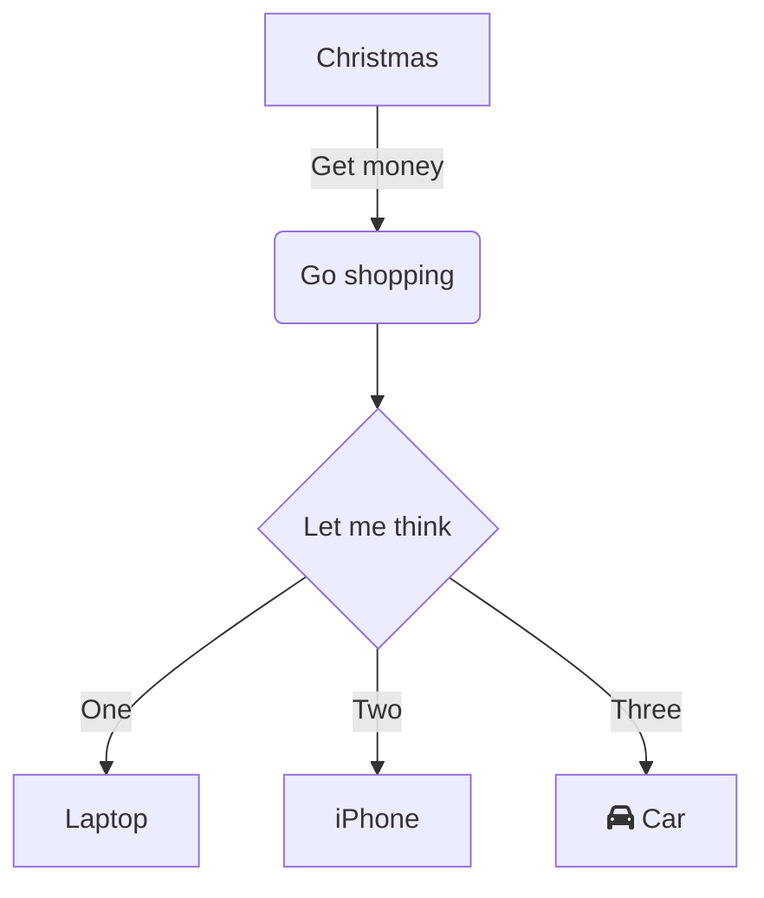

# Pagina 1

Esto es una pagina de prueba

## Titulo nivel 2

### titulo nivel 3

Texto blablabla

#### Titulo 4

##### Titulo 5

###### Titulo 6

####### titulo7 (esto es un parrafo normal)

Dentro de este parrafo _esto_ esta en cursiva, **esto** en negrita y **_esto_** en cursiva y negrita.

- Esto es una lista no ordenada
- Esto es otro elemento de la lista
  - Esto es un elemento anidado
- Esto es un elemento mas

1. Esto es una lista numerada
   - Elemento no numerado
2. Esto es una lista numerada 2
   1. Esto es una lista anidada
   2. Sub elemento
   3. Sub elemento 3
      1. Sub-sub
3. Volvemos a la lista

- [ ] Tarea 1
- [x] Tarea 2

> Esto es una cita
>
> > Cita anidada
>
> Una cita puede estar formado par mas de una linea
>
> - lista dentro de una cita
> - Otro elemento

Para inicializar un repo de git usamos `git init`

El sigiente fragmento de codigo Java:

```Java
public class HolaMundo{
    public static void main (String[]args){
        System.out.println("Hola mundo");
    }
}
```

```bash
git init
git add .
git commit -m "mi primer comit"
```


[**_Apuntes de la asignatura_**](https://despregamento-2025-26.vercel.app/docs/despregamento-aplicacions-web)

[Pagina main](paginaMain.md)

[Titulo principal](#pagina-1)

[Markdown guide][1]

[1]: https://www.markdownguide.org/

🦞

Para poder ver en negrita debemos escribir \*\*negrita\*\*

Para representar simbolos: \*

| Encabezado 1 | Encabezado 2 | Encabezado 3 | Encabezado 4 | Encabezado 5 |
| ------------ | :----------: | -----------: | ------------ | ------------ |
| Celda 1      |   Celda 2    |      Celda 3 | Celda 4      | Celda 5      |
| Celda 6      |   Celda 7    |      Celda 8 | Celda 9      | Celda 10     |

Diagramas:


